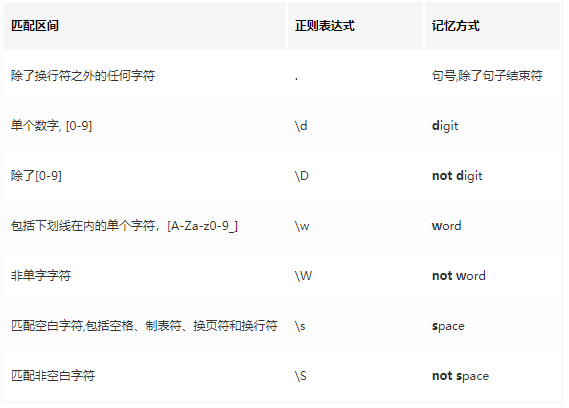
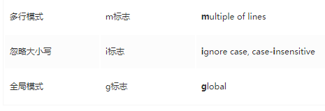
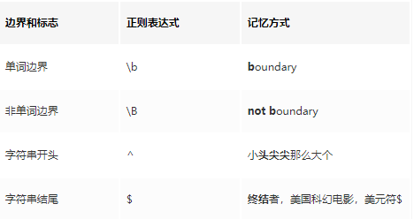

# 正则表达式基本语法

## 从正则表达式的作用理解语法

> 正则表达式的作用主要是从一个字符串文本中查找一个或一类字符串

所以语法起码要有的功能有：

- 确认寻找的字符串在文本中的位置
- 分辨一个字符是中文、英文还是其他符号
- 字符的数量
- 与或非逻辑

## 正则表达式基本语法

### 锁定字符在文本中的位置

两个特殊的符号'^'和'$'。他们的作用是分别指出一个字符串的开始和结束。

例子如下：
```
"^The"：表示所有以"The"开始的字符串（"There"，"The cat"等）；
"of despair$"：表示所以以"of despair"结尾的字符串；
"^abc$"：表示从头到尾只有"abc"了；
"notice"：表示任何位置包含"notice"的字符串。

最后那个例子，如果你不使用两个特殊字符，你就在表示要查找的串在被查找串的任意部分——你并不把它定位在某一个顶端。
```

### 锁定字符的类型

- '.'表示任何字符
- '[ascii范围]'表示一个某一类字符
- 方括号里用'^'表示不希望出现的字符
- 规定转义符号\d \D \w \W \s \S
```
[ab]：表示一个字符串有一个"a"或"b"（相当于"a¦b"）；
[0-9]：表示一个数字
[a-zA-Z]：表示一个字母
[a-zA-Z0-9]：表示一个字母或数字
%[^a-zA-Z]%:表示两个百分号中不应该出现字母
```




### 锁定字符的数量

'*'，'+'和'?'这三个符号，表示一个或一序列字符重复出现的次数。它们分别表示“没有或更多”，“一次或更多”还有“没有或一次”。下面是几个例子：

```
"ab*"：表示一个字符串有一个a后面跟着零个或若干个b。（"a", "ab", "abbb",……）；
"ab?"：表示一个字符串有一个a后面跟着零个或者一个b；
"ab+"：表示一个字符串有一个a后面跟着至少一个b或者更多；
"a?b+$"：表示在字符串的末尾有零个或一个a跟着一个或几个b。
```


你也可以使用范围，用大括号括起，用以表示重复次数的范围。

```
"ab{2}"：表示一个字符串有一个a跟着2个b（"abb"）；
"ab{2,}"：表示一个字符串有一个a跟着至少2个b；
"ab{3,5}"：表示一个字符串有一个a跟着3到5个b。
```

请注意，你必须指定范围的下限（如："{0,2}"而不是"{,2}"）。还有，你可能注意到了，'*'，'+'和
'?'相当于"{0,}"，"{1,}"和"{0,1}"。


### 与或操作

还有一个'¦'，表示“或”操作：

"hi¦hello"：表示一个字符串里有"hi"或者"hello"；
"(b¦cd)ef"：表示"bef"或"cdef"；
"(a¦b)*c"：表示一串"a""b"混合的字符串后面跟一个"c"；

### 匹配模式

- /\d\w+/ 我们利用左划线把正则表达式圈起来，方便辨识，同时可以设置不同的匹配模式
- 例如：/^I am scq000\.$/i 



### 边界标志



### 转义字符

- 对于上面已经提到的符号要是想要使用它的领一方面表达（功能表达或字符表达）我们只能使用右划线进行转义\,如：w(表示字符w) \w(表示任意字符) $ (表示字符串尾部)  \$(表示字符'$')


### 正则表达式的可视化表达工具
大家可以利用[www.regexper.com](https://regexper.com/)这个工具很好地可视化自己写的正则表达式（Regular expression）:

### 练习demo

```
"a.[0-9]"：表示一个字符串有一个"a"后面跟着一个任意字符和一个数字；
"^.{3}$"：表示有任意三个字符的字符串（长度为3个字符）；
"[0-9]%"：表示一个百分号前有一位的数字；
",[a-zA-Z0-9]$"：表示一个字符串以一个逗号后面跟着一个字母或数字结束。

```

### 常用demo
详情查看另两篇文章：
- [js的字符串函数](./JavaScript/js的字符串函数.md)中的replace()
- [js高频正则表达式用法](./JavaScript/js中常用的正则表达式用法.md)